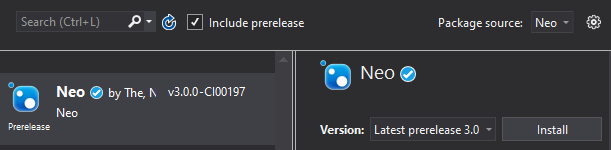

<p align="center">
  <a href="https://neo.org/">
      
  </a>
</p>

<h3 align="center">Neo Blockchain</h3>

<p align="center">
   A modern distributed network for the Smart Economy.
  <br>
  <a href="https://docs.neo.org/docs/en-us/index.html"><strong>Documentation »</strong></a>
  <br>
  <br>
  <a href="https://github.com/neo-project/neo"><strong>Neo</strong></a>
  ·
  <a href="https://github.com/neo-project/neo-vm">Neo VM</a>
  ·
  <a href="https://github.com/neo-project/neo-plugins">Neo Plugins</a>
  ·
  <a href="https://github.com/neo-project/neo-devpack-dotnet">Neo DevPack</a>
  ·
  <a href="https://github.com/neo-project/neo-cli">Neo CLI</a>
  ·
  <a href="https://github.com/neo-project/neo-gui">Neo GUI</a>
</p>
<p align="center">
  <a href="https://twitter.com/neo_blockchain">
      
  </a>
  &nbsp;
  <a href="https://medium.com/neo-smart-economy">
      
  </a>
  &nbsp;
  <a href="https://neonewstoday.com">
      
  </a>
  &nbsp;  
  <a href="https://t.me/NEO_EN">
      
  </a>
  &nbsp;
  <a href="https://www.reddit.com/r/NEO/">
      
  </a>
  &nbsp;
  <a href="https://discord.io/neo">
      
  </a>
  &nbsp;
  <a href="https://www.youtube.com/channel/UCl1AwEDN0w5lTmfJEMsY5Vw/videos">
      
  </a>
  &nbsp;
  <!--How to get a link? -->
  <a href="https://neo.org/">
      
  </a>
  &nbsp;
  <a href="https://weibo.com/neosmarteconomy">
      
  </a>
</p>


## Table of Contents
1. [Overview](#example)
1. [Features](#example)
2. [Quickstart](#example2)
    1. [Using for smart-contract development](#smart-contract)
    1. [Using neo library](#smart-contract)
    1. [Using with Unity]()
    2. [Using neo-cli releases](#third-example)
    3. [Using docker](#third-example)
    3. [Using plugins]()
    3. [Writing a plugin](#third-example)
    3. [Running a single node blockchain]()
4. [Status](#fourth-examplehttpwwwfourthexamplecom)
    1. [Repository status]()
    2. [Development progress]()
5. [Neo 3](#fourth-examplehttpwwwfourthexamplecom)
    1. [Differences between Neo 2 and Neo 3](#fourth-examplehttpwwwfourthexamplecom)
    3. [Neo 3 Explorer](#explorer)
    3. [Daily builds](#daily-builds)
6. [Opening a new issue](#)
5. [Requesting new features](#fourth-examplehttpwwwfourthexamplecom)
6. [Reporting a bug](#fourth-examplehttpwwwfourthexamplecom)
5. [Developer support]()
5. [Bounty program]()
7. [Articles and blogs](#fourth-examplehttpwwwfourthexamplecom)
7. [How to contribute](#fourth-examplehttpwwwfourthexamplecom)

## Overview
Neo is a blockchain technology built using C# that levereages smart contracts to autonomumously manage digital assets. Using dBFT 2.0 as consensus mechanism, Neo can achieves single block finality in 15 seconds without forking. 

To learn more about NEO, please read the White Paper:  
- [English](https://docs.neo.org/en-us/whitepaper.html)  
- [白皮书](https://docs.neo.org/zh-cn/whitepaper.html)

*Note: This is Neo 3 branch, currently under development. For the current stable version, please [click here]()*

## Features
These are a few features Neo has:

- **[dBFT2.0](https://medium.com/neo-smart-economy/neos-dbft-2-0-single-block-finality-with-improved-availability-6a4aca7bd1c4)**
  - Single block finality consensus algorithm.
- **[Smart Contracts using C#](https://github.com/neo-ngd/NEO3-Development-Guide/tree/master/en/SmartContract)**
  - Classes and JSON support;
  - Python, Typescript and Go Smart Contracts provided by community projects.
- **[Unity support](https://github.com/neo-ngd/NEO3-Development-Guide/tree/master/en/SmartContract)**
  - Neo can be used to create your game in the blockchain.
- **[Debugger support]()**
  - Breakpoints, variable and storage inspection using Visual Studio Code.
- **[Plugin system]()**
  - Used to extend Neo functinalities, the plugin system allow developers to easily add new features to their nodes.
- **[Native contracts](https://medium.com/neo-smart-economy/native-contracts-in-neo-3-0-e786100abf6e)**
  - Contracts running C# code.
- **[Smart Contract internet access](https://medium.com/neo-smart-economy/on-the-importance-of-oracles-neo-3-0-and-dbft-17c37ee35f32)**
  - Internet acess during a transaction.
- **[Voting Mechanism](https://medium.com/neo-smart-economy/how-to-become-a-consensus-node-27e5317722e6)**
  - Decentralizing control over the network by allowing NEO holders to vote for consensus nodes.
- **[Distributed file-system]()**
  - NeoFS is a scalable, decentralized object storage network integrated with NEO contracts to provide trustless data storage facilities.
- **[Digital identity]()**
  - Using trust, privacy and game theory models. (WIP)


## Quick Start

#### Building a sample smart-contract
You need to use [neo-devpack-dotnet](https://github.com/neo-project/neo-devpack-dotnet) if you want to build smart contracts.

1. Clone https://github.com/neo-project/neo-devpack-dotnet  
2.  Create a new .NET class library solution for your smart-contract.  
3.  Open the project and add   `Neo.SmartContract.Framework.csproj` and `Neo.Compiler.MSIL.csproj` to your solution (inside repo from step 1).   
4.  Add a reference to `Neo.SmartContract.Framework` to your smart-contract project.  
5. Import common used APIs to your project file:
    ```csharp
    using Neo.SmartContract.Framework;
    using Neo.SmartContract.Framework.Services.Neo;
    using Neo.SmartContract.Framework.Services.System;
    ```
6. Extend the SmartContract class and add the entrypoint method:
    ```csharp
    public class Contract : SmartContract
    {
        public static object Main(string operation, object[] args)
        {
            return "Hello World";
        }
    }
    ```

7. Build `Neo.SmartContract.Framework.csproj` project. Check where neon.dll is saved, example:  
    ```
    C:\Users\ricar\Workspace\readme-test\neo-devpack-dotnet\src\Neo.Compiler.MSIL\bin\Debug\netcoreapp2.0\neon.dll
    ```
8. Add a post build event to your smart-contract project:

    ```
    dotnet  C:\Users\ricar\Workspace\readme-test\neo-devpack-dotnet\src\Neo.Compiler.MSIL\bin\Debug\netcoreapp2.0\neon.dll $(TargetPath)
    ```

9. Verify if the contract was sucessfully compiled:
    ```
    2>gen abi succ
    2>write:contract.nef
    2>write:contract.abi.json
    2>write:contract.manifest.json
    2>SUCC
    ```

#### Using Neo 3 .NET blockchain library 
Use this to run a node or send commands to the network.  
This is how you should use Neo. If you can't use C#, consider using RPC endpoints with [neo-cli](https://github.com/neo-project/neo-cli).  


1. Create a new .NET Core Console project;  
2. Add Neo nuget repository reference:
    ```
    https://www.myget.org/F/neo/api/v3/index.json
    ```  
3. Check the `Include Prerelease` checkbox to be able to see Neo 3 packages.  
4. Select and install `Neo` library:

      

5.  Windows - Add `libleveldb.dll` to your project using a pre-compiled version:
    1. Download latest [neo-cli](https://github.com/neo-project/neo-cli/releases/download/v3.0.0-preview1/neo-cli-win-x64.zip) (preview version)  release for Windows.
    2. Extract the files and copy `libleveldb.dll` to your project folder;
    3. Go to Visual Studio and add `libleveldb.dll` to your project;
    4. Open the file properties configure it to be copied to the output folder.  

You can also compile LevelDB from [source](https://github.com/google/leveldb) and add it to your project.  

5. Linux - Install dependencies:
    ```bash
    apt-get update && apt-get install -y \
        libleveldb-dev \
        sqlite3 \
        libsqlite3-dev \
        libunwind8-dev 
    ```
    *Check out our [Dockerhub]() for more linux examples.*

6. Use the RPC Client:
    ```CSharp
    var rpcClient = new RpcClient("http://seed1t.neo.org:20332");
    var block = rpcClient.GetBlock(0);
    Console.WriteLine("Block: " + block.Block.Hash);
    ```
2. (Optional) Run a local node:  
    You can use plugins for the most common use cases. If you think we need to add a new plugin please [open a new issue]().
    ```CSharp
    private void Start()
    {
        store = new LevelDBStore(Path.GetFullPath(Settings.Default.Paths.Chain));
        system = new NeoSystem(store);
        system.StartNode(new ChannelsConfig
        {
            Tcp = new IPEndPoint(IPAddress.Any, Settings.Default.P2P.Port),
            WebSocket = new IPEndPoint(IPAddress.Any, Settings.Default.P2P.WsPort),
            MinDesiredConnections = Settings.Default.P2P.MinDesiredConnections,
            MaxConnections = Settings.Default.P2P.MaxConnections,
            MaxConnectionsPerAddress = Settings.Default.P2P.MaxConnectionsPerAddress
        });
    }
    ```
    *Visit [neo-cli]() for more code examples.*

#### Running a Neo node using neo-cli
Neo-cli is a full node with wallet capabilities. It also supports RPC endpoints allowing it to be managed remotely.  

1. Download neo-cli from the release page
2. Run neo-cli executable file
    1. (Optional) Start it with `--rpc` to enable RPC (HTTP endpoints)
4. Start it with `-t` to use testnet configuration  
    ```bash
    dotnet neo-cli.dll -t --rpc
    ```
5. (Optional) If you can't run it using the command line, replace the `protocol.json` file with the `protocol.testnet.json` content to access the testnet.


5. Use `help` to see the command list.

#### Running a Neo node using Docker
You can run Neo using neo-cli inside a docker container.  

1. Pull one of our base images: 
    ```bash
    docker pull neofoundation/neo3:testnet-slim-centos7
    ```
2. Run it exposing the required ports and a volume to store persistent data:
    ```
    docker run -p 20332-20336:20332-20336 -v persistentData:/neo-cli/persistentData neofoundation/neo3:testnet-slim-centos7
    ```


#### Using a light-wallet
A light wallet is the easiest way to interact with the Neo blockchain. If you are only interested in use Neo dApps and not build one, a light-wallet may be the best option for you.  
For Neo 3 (development), use [Neo3-preview.com](https://neo3-preview.com/) (community supported).  

If you are looking use Neo with real assets, find your prefered wallet [here](https://neo.org/wallets).

## Status
<p>
  <a href="https://travis-ci.org/neo-project/neo">
    
  </a>
  <a href="https://github.com/neo-project/neo/releases">
    
  </a>
  <a href="https://codecov.io/github/neo-project/neo/branch/master/graph/badge.svg">
    
  </a>
  <a href="https://github.com/neo-project/neo/blob/master/LICENSE">
    
  </a>
</p>


#### Reference implementation
Neo 

* [neo](https://github.com/neo-project/neo/tree/master-2.x): Neo core library.
* [neo-vm](https://github.com/neo-project/neo-vm/tree/master-2.x): N
* [neo-cli](https://github.com/neo-project/neo-cli/tree/master-2.x): 
* [neo-plugins](https://github.com/neo-project/neo-plugins/tree/master-2.x): 
* [neo-devpack-dotnet](https://github.com/neo-project/neo-devpack-dotnet/tree/master-2.x): 


If you find issues with your current OS, [please open an issue](https://github.com/neo-project/neo/issues/new/choose) or use one of our [docker images](https://hub.docker.com/u/neofoundation) instead.


The NEO project is licensed under the [MIT license](LICENSE).
